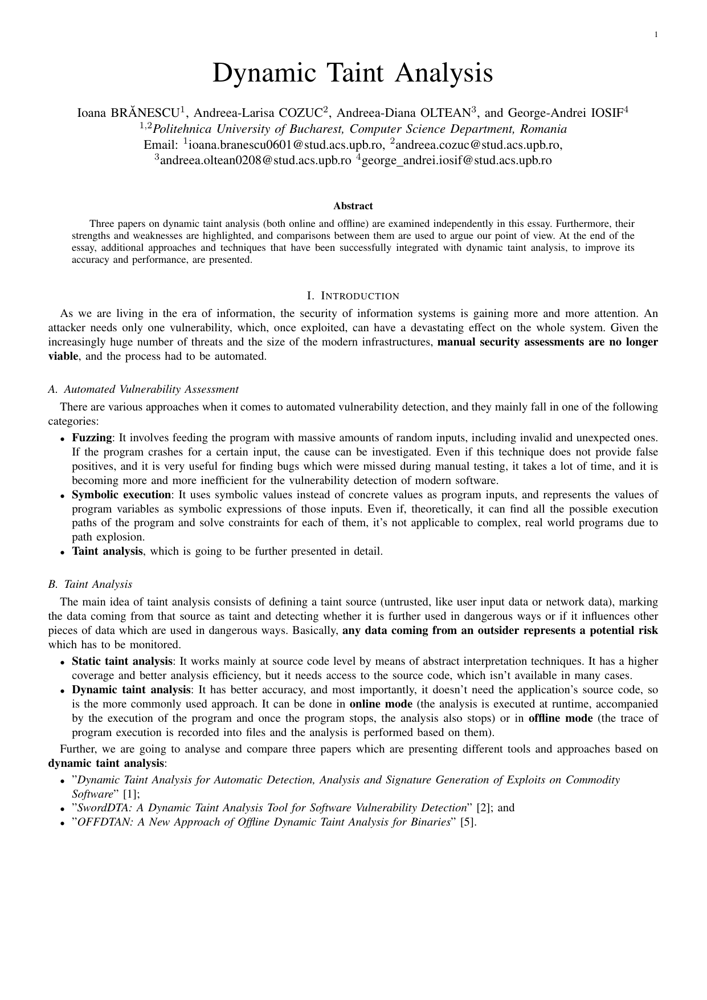
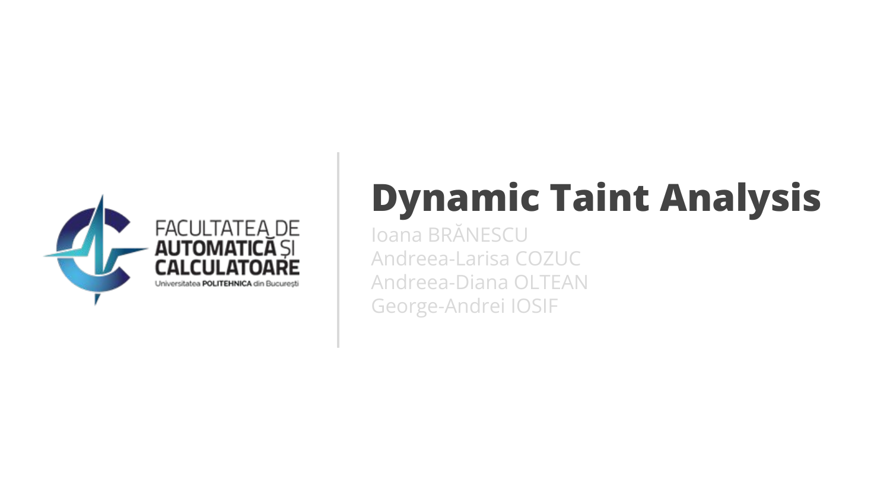

# Dynamic Taint Analysis Essay 📜

## Description 🖼️

This repository contains an essay about **dynamic taint analysis**. This was created for a course from Faculty of Automatic Control and Computers, University POLITEHNICA of Bucharest, namely "*Security of Informational Systems*".

## Folders Structure 📁

The folder structure is as follows:
- **[`essay`](essay)**: The LaTeX project and the exported essay.
- **[`presentation`](presentation)**: The exported Google Slides presentation.

## Preview 👀

| Essay                                                                                                        | Presentation                                                                                                                         |
|--------------------------------------------------------------------------------------------------------------|--------------------------------------------------------------------------------------------------------------------------------------|
| <a href="essay/essay.pdf"><kbd></kbd></a> | <a href="presentation/presentation.pdf"><kbd></kbd></a> |

## Contributors 🤝

- Ioana BRĂNESCU ([@ioanabranescu](https://github.com/ioanabranescu))
- Andreea-Larisa COZUC ([@andreeacozuc25](https://github.com/andreeacozuc25))
- Andreea-Diana OLTEAN ([@deeaoltean](https://github.com/deeaoltean))
- George-Andrei IOSIF ([@iosifache](https://github.com/iosifache))